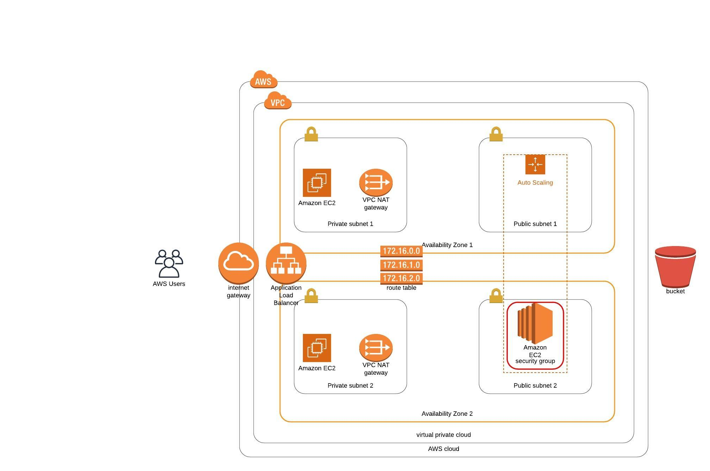

# CloudFormation handson

A simple example web-application [udagram] deployment on AWS with the help of CloudFormation templates
With this project one will be able to successfully create an EC2 instance with ready to use web-application

## Design


## Prerequisites

AWS CLI
Basic undestanding of Cloudformation, Json, VPC, Subnets, InternetGateway, EC2, Security group, LoadBalancer

## Files included

aws-stack.sh          which manages AWS Cloudformation stack create/delete/update functionalities
infra.yaml            CloudFormation template to create the Infra Stack
infra.json            Paramaters in json format for the infra
udagram-project.yaml  CloudFormationtemplate to bring up the AutoScaling group to deploy the Udagram web application
udagram-project.json  Parameters in json format for the udagram project deployment

## Deployment

Run AWS configure to talk to AWS with programatic user account

- Create Infra stack
- Run `./aws-stack.sh us-east-2 create infra.yaml infra.json`

_Note: This step would call cloudformation create stack with infra.yml as template and infra.json
as parameters to the cloudformation template_

Run AWS configure to talk to AWS with programatic user account

- Create Deployment stack
- Run `./aws-stack.sh us-east-2 create udagram-project.yaml udagram-project.json`

_Note: This step would call cloudformation create stack with udagram-project.yaml as template and udagram-project.json
as parameters to the cloudformation template_


## Verifying the app

Post successful deeployment of infra and depeloyment stack, the web-application would bee deployed and will be available
for access over and ELB with public access


Project Structure:

```
.
├── README.md
├── aws-stack.sh
├── infra.json
├── infra.yaml
├── udagram-project.json
└── udagram-project.yaml


```
